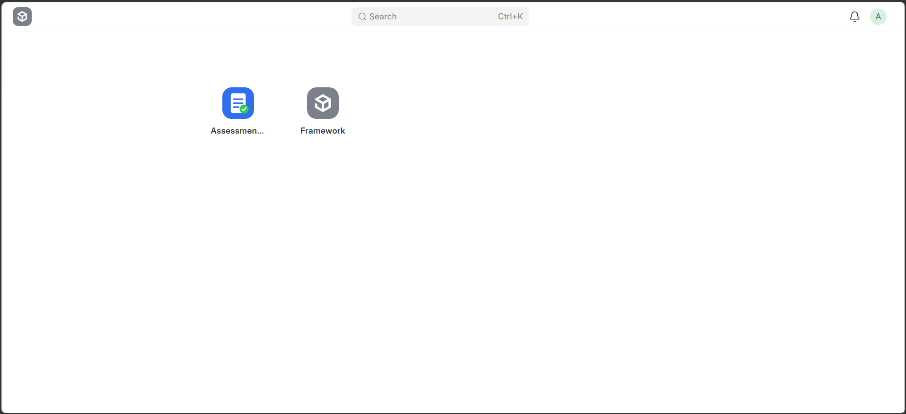
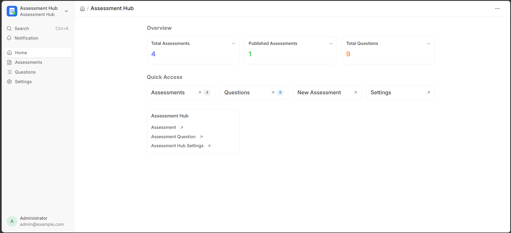
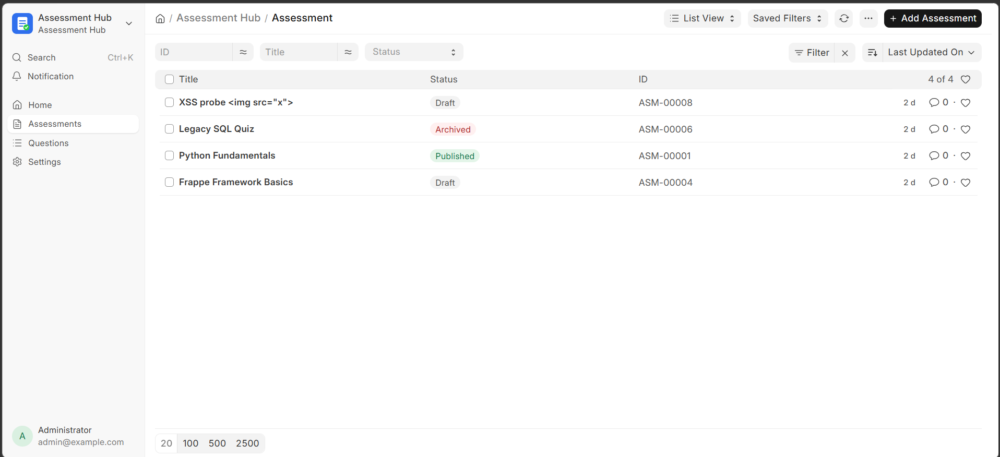
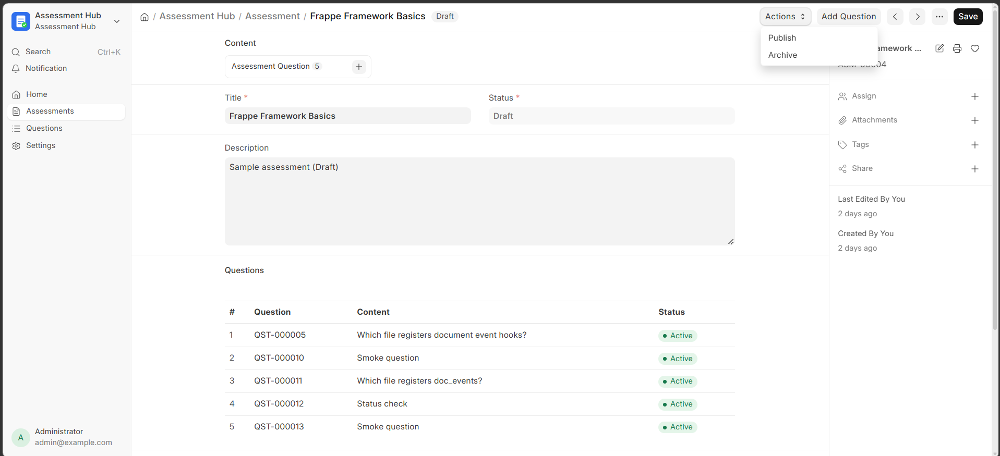
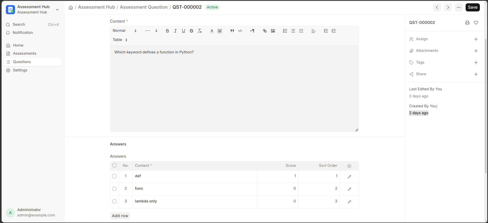
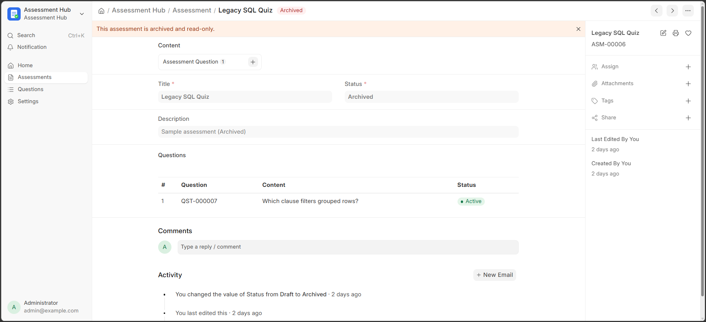
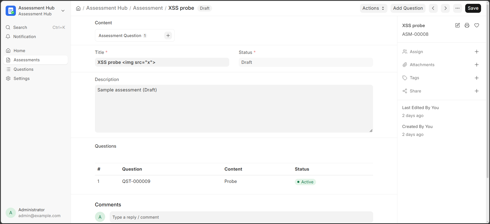
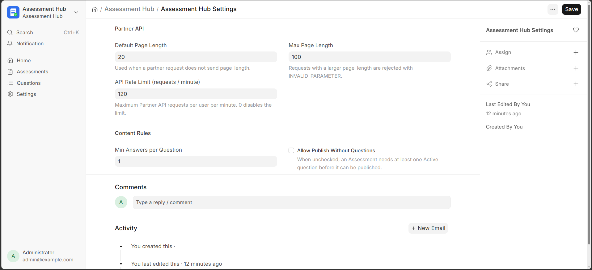

# Assessment Hub


A Frappe v16 custom app that manages Assessment → Question → Answer content on Desk with role-based access, and exposes a Partner REST API for third-party systems (LMS, HR Portal, etc.) to read and create that content safely.

## Features

- Guarded status lifecycle (Draft → Published → Archived, Archived is read-only) — [`assessment.py`](assessment_hub/assessment_hub/doctype/assessment/assessment.py), [`test_assessment.py`](assessment_hub/assessment_hub/doctype/assessment/test_assessment.py)
- Roles `Assessment Manager` / `Assessment Viewer`, created idempotently on install and cleaned up on uninstall — [`install.py`](assessment_hub/install.py), [`test_install.py`](assessment_hub/tests/test_install.py)
- Desk v16 workspace with sidebar, desktop icon, and 3 live number cards — [`workspace/assessment_hub/`](assessment_hub/assessment_hub/workspace/assessment_hub/)
- Publish / Archive / Add Question actions and an XSS-safe questions preview on the Assessment form — [`assessment.js`](assessment_hub/assessment_hub/doctype/assessment/assessment.js)
- Partner REST API (`/api/v2/method/assessment_hub.api.v1.*`) with a uniform `{"data"}` / `{"errors"}` envelope and no `ignore_permissions` anywhere — [`api/v1/`](assessment_hub/api/v1/), [`test_api_security.py`](assessment_hub/tests/test_api_security.py)
- Atomic question+answers creation with savepoint rollback on any failure — [`questions.py`](assessment_hub/api/v1/questions.py), [`test_api_questions.py`](assessment_hub/tests/test_api_questions.py)
- Constant-query-count nested question/answer loading (no N+1) — [`_queries.py`](assessment_hub/api/v1/_queries.py), `test_include_questions_query_count_does_not_grow_with_questions`
- Configuration via a Settings DocType instead of hard-coded values — [`assessment_hub_settings.py`](assessment_hub/assessment_hub/doctype/assessment_hub_settings/assessment_hub_settings.py)

## Requirements

- Frappe Framework, branch `version-16`
- Python 3.14
- Node.js 24, Yarn 1.22+
- MariaDB 11.8+ (full `utf8mb4` support)
- Redis 6+

These exceed the technical-test sheet's stated minimums (Python 3.11 / MariaDB 10.6) because Frappe `version-16` itself requires Python 3.14 and MariaDB 11.8 to run.

## Installation

```bash
cd ~/frappe-bench
bench get-app https://github.com/Hieuxuan1112/assessment_hub --branch main
bench --site <site> install-app assessment_hub
bench --site <site> migrate
```

Installing automatically, with no manual steps:

- creates the `Assessment Manager` and `Assessment Viewer` roles (desk access enabled) and their DocPerms (declared in each DocType's JSON);
- creates the `Assessment Hub` Workspace, Workspace Sidebar, Desktop Icon and 3 Number Cards;
- stores default `Assessment Hub Settings` (page-length limits, minimum answers per question, publish-without-questions toggle).

To remove the app:

```bash
bench --site <site> uninstall-app assessment_hub
```

This removes the app's DocTypes, Workspace, Number Cards, Workspace Sidebar, Desktop Icon, and the two roles (including their `Has Role`/`Custom DocPerm` rows) — verified by [`scripts/verify_uninstall.sh`](scripts/verify_uninstall.sh), which also proves a clean reinstall afterwards. `bench migrate` on a site with existing data is also part of that verification.

## Configuration

`Assessment Hub Settings` (Desk: Assessment Hub → Settings):

| Field | Default | Effect |
|---|---|---|
| `default_page_length` | 20 | used by the Partner API when a request omits `page_length` |
| `max_page_length` | 100 | requests with a larger `page_length` are rejected (`INVALID_PARAMETER`) |
| `min_answers_per_question` | 1 | a Question needs at least this many Answers to save |
| `allow_publish_without_questions` | off | when off, publishing needs ≥ 1 Active Question |

Assign roles to a user from their **User** form → **Roles** section: add `Assessment Manager` (create/edit/publish) or `Assessment Viewer` (read-only), for both Desk and the Partner API.

## Using Desk

| | |
|---|---|
|  | The app appears on `/desk` as its own icon. |
|  | The workspace shows live counts and quick links. |
|  | List indicators: Draft gray, Published green, Archived red. |
|  | Publish / Archive / Add Question actions, with an escaped questions preview. |
|  | Answers are edited inline as a child table. |
|  | An archived Assessment is locked, with no action buttons. |
|  | Malicious HTML in a title/question renders as inert text, never executes. |
|  | Assessment Hub Settings form. |

## Partner API quick start

Generate an API key/secret from a user's **User** form → **Settings** → **API Access** → **Generate Keys**.

| Method | Path | Purpose |
|---|---|---|
| GET | `.assessments.list_assessments` | paginated list, filter by status/title/updated-since |
| GET | `.assessments.get_assessment` | one assessment, optionally nested with its questions and answers |
| GET | `.questions.list_questions` | questions of one assessment, ordered by `sort_order` |
| POST | `.questions.create_question` | create a question with its answers atomically |

```bash
curl -s "http://<site>/api/v2/method/assessment_hub.api.v1.assessments.list_assessments?status=Draft" \
  -H "Authorization: token $VIEWER_TOKEN"

curl -s -X POST "http://<site>/api/v2/method/assessment_hub.api.v1.questions.create_question" \
  -H "Authorization: token $MANAGER_TOKEN" -H "Content-Type: application/json" \
  -d '{"assessment_id":"ASM-00001","content":"<p>2+2=?</p>","answers":[{"content":"4","score":1},{"content":"5","score":0}]}'
```

Full contract, error codes, pagination and real captured request/response examples: [`docs/API.md`](docs/API.md). Ready-to-import collection: [`docs/postman/assessment_hub.postman_collection.json`](docs/postman/assessment_hub.postman_collection.json).

## Architecture decisions

**Answer is a Child Table of Question**, not a standalone DocType. Answers are only ever edited together with their question (inline grid on the question form), and a Child Table lets `doc.insert()` write the parent and all its rows in one transaction — which is exactly what `questions.create_question` needs for atomic creation. The trade-off: answers cannot be queried, permissioned or reused independently of their question; if that's ever needed, a standalone DocType can be introduced later with a data patch.

Full rationale, ER diagram, status lifecycle, install/uninstall lifecycle, indexes with real `EXPLAIN` output, and the security model: [`docs/ARCHITECTURE.md`](docs/ARCHITECTURE.md).

## Development & testing

```bash
# Run the integration test suite (needs a site with allow_tests enabled)
bench --site <test-site> run-tests --app assessment_hub

# Exercise the Partner API over real HTTP against a running site
bash scripts/smoke_api.sh http://<site>:<port> /path/to/tokens.env

# Prove install -> uninstall -> reinstall leaves no leftovers
bash scripts/verify_uninstall.sh <site>

# Lint/format everything (ruff, eslint, prettier)
pre-commit run --all-files
```

| Test file | Proves | Tests |
|---|---|---|
| `tests/test_install.py` | roles/settings created idempotently | 4 |
| `assessment_hub/doctype/assessment/test_assessment.py` | Assessment status lifecycle | 10 |
| `assessment_hub/doctype/assessment_question/test_assessment_question.py` | Question/Answer validation, archive guard, ordering, index | 14 |
| `tests/test_api_response.py` | error envelope, savepoint rollback | 7 |
| `tests/test_api_params.py` | strict parameter parsing | 11 |
| `tests/test_api_assessments.py` | `list_assessments` / `get_assessment`, no-N+1 | 19 |
| `tests/test_api_questions.py` | `list_questions` / `create_question`, atomic rollback | 14 |
| `tests/test_api_security.py` | no `ignore_permissions`/raw SQL, correct whitelisting | 2 |
| **Total** | | **81** |

`scripts/smoke_api.sh` runs 15 real-HTTP checks against the running app; `scripts/verify_uninstall.sh` runs 9 leftover checks plus a reinstall check.

## CI

`.github/workflows/ci.yml` on every push to `main` and every pull request:

1. sets up Python 3.14, Node 24, and a fresh `bench init --frappe-branch version-16`;
2. installs `assessment_hub` on a brand-new site;
3. runs `bench migrate` **twice** to prove the patch is idempotent;
4. runs the full integration test suite;
5. seeds sample data and API users, starts `bench serve`, and runs `scripts/smoke_api.sh` over real HTTP;
6. runs `scripts/verify_uninstall.sh` to prove a clean uninstall and reinstall.

## Project structure

```
assessment_hub/
├── api/v1/                    # Partner REST API (_response, _params, _serializers, _queries, assessments, questions)
├── assessment_hub/
│   ├── doctype/                # Assessment, Assessment Question, Assessment Answer, Assessment Hub Settings
│   ├── number_card/, workspace/
├── desktop_icon/, workspace_sidebar/   # app-level Desk v16 records
├── patches/v1_0/
├── tests/                      # cross-cutting tests (install, API); doctype tests live beside their doctype
├── utils/                      # settings accessor, dev_seed helpers
├── install.py                  # after_install / before_uninstall hooks
└── hooks.py
docs/                           # ARCHITECTURE.md, API.md, Postman collection, screenshots
scripts/                        # smoke_api.sh, verify_uninstall.sh
```

## AI Disclosure

### A. Tools
- **Claude Code** (Anthropic), desktop app.
  - **Claude Opus 5** was used to analyse the test sheet, brainstorm the design, verify Frappe v16 internals against the framework source (install order, v2 response handling, savepoints, sanitization), and write the design spec and step-by-step implementation plan.
  - **Claude Sonnet 5** implemented the plan task by task: code, tests, scripts, CI and first drafts of the documentation.
- No other AI tools were used.

### B. Sample prompts
1. "Here are the JD, my CV and the test sheet. Use the superpowers skills to plan, in detail, what to build so the submission is production quality; I will implement with a different model, so write the plan so that it can follow every step."
2. "Before writing the plan, confirm three points: whitelisted v2 methods must check permissions with frappe.has_permission instead of ignore_permissions; get_assessment must load all answers in one frappe.get_all instead of a nested loop; roles must be cleaned up in before_uninstall."
3. "Execute Task 7 of the plan: write the failing tests first, run them, implement, run them again, then commit."

### C. How AI output was controlled
- Design decisions were made in a written spec before any code, and approved by me.
- Every task followed test-first development: failing test → implementation → passing test → commit.
- Framework behaviour was checked against the Frappe `version-16` source rather than assumed; every place reality differed from the plan (a bug found in a verification script, a real uninstall leftover, environment quirks) is logged with what was found and how it was fixed.
- Automated gates: 81 integration tests, a security test that forbids `ignore_permissions`/raw SQL in the API package, a 15-check real-HTTP smoke test, a 9-check uninstall/reinstall verification, and CI running all of it on a fresh site.
- Git history note: because implementation ran ahead of my own git checkpoints, Tasks covering the data model, API, Desk UX and CI tooling landed in one larger commit instead of four separate ones. The code itself is unaffected — all tests and checks above pass — only the commit granularity is coarser than originally planned.

### D. What I reviewed and changed myself
<!-- Filled in by Ngo Xuan Hieu. Keep only lines that are true. -->

## License

MIT
