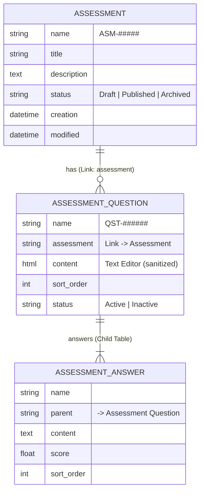
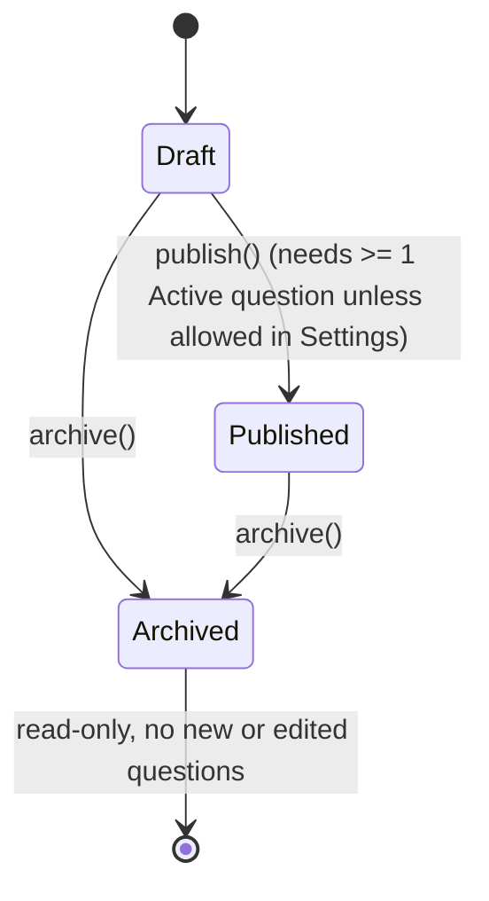

# Architecture

## 1. Data model



`Assessment Hub Settings` (Single): `default_page_length`, `max_page_length`, `min_answers_per_question`, `allow_publish_without_questions`.

DocType names are prefixed (`Assessment Question`, `Assessment Answer`) so they cannot collide with other apps on the same site (e.g. LMS, HRMS). The API keeps the plain contract names.

## 2. Decision: Answer is a Child Table of Question

| Concern | Child Table (chosen) | Standalone DocType |
|---|---|---|
| Desk data entry | Inline grid inside the question form | Separate form per answer |
| Atomic create | One `doc.insert()` writes parent + rows in one transaction | Needs explicit multi-document transaction handling |
| Permissions | Inherited from the question | Second set of DocPerms to maintain |
| Deleting a question | Rows go with it; no orphans | Needs cascade logic |
| Querying answers independently | Not possible via Desk list | Possible |
| Reusing an answer across questions | No | Possible |

Answers only make sense inside their question, are edited together with it, and are never shared, so the Child Table wins. If partners later need per-answer analytics, a standalone DocType can be introduced with a data patch.

Question is **not** a child of Assessment: it has its own status, ordering, list view, API endpoint, and can grow large.

## 3. Status lifecycle



Rules are enforced in `Assessment.validate` / `AssessmentQuestion.validate` (server). Desk buttons and link filters only mirror them.

## 4. Install / uninstall lifecycle

In Frappe v16 `install_app` runs, in order: DocType sync → `after_install` → `sync_fixtures`. Roles are therefore ensured in code (`assessment_hub/install.py`), because fixtures would arrive **after** `after_install` needs them.

| Stage | What runs | Idempotent |
|---|---|---|
| install | DocTypes, Workspace, Number Cards, Workspace Sidebar, Desktop Icon synced from JSON; `after_install` → `ensure_roles`, `ensure_default_settings` | yes |
| migrate | `patches.txt` → `v1_0.ensure_default_settings` (writes only never-stored settings) | yes (CI migrates twice) |
| uninstall | `before_uninstall` → `remove_roles` (deletes Has Role / Custom DocPerm / Role) + `remove_app_level_records` (deletes app-level Desktop Icon / Workspace Sidebar rows, which are not linked to Module Def and survive Frappe's own cleanup); Frappe removes module-linked DocTypes, Workspace and Number Cards on its own | verified by `scripts/verify_uninstall.sh`, also run in CI |

Permissions are standard DocPerms inside each DocType JSON. `Custom DocPerm` is the mechanism for changing permissions of DocTypes owned by *other* apps, so it is not used for our own DocTypes.

| DocType | System Manager | Assessment Manager | Assessment Viewer |
|---|---|---|---|
| Assessment | all | read, write, create, delete, report, export, print, email, share | read, report, print |
| Assessment Question | all | same as above | read, report, print |
| Assessment Hub Settings | read, write | read, write | none |

## 5. Indexes and query plans

- Composite index `assessment_sort_order_index (assessment, sort_order)` on `tabAssessment Question`, added in `on_doctype_update()`. It serves `list_questions` (filter + order) and `get_assessment?include_questions=1`.
- `modified` is indexed by Frappe on every table and serves `updated_since`.
- `get_assessment?include_questions=1` runs a constant number of queries regardless of question count: 1 `get_list` for questions + 1 `get_all` for all their answers. This is asserted by `test_include_questions_query_count_does_not_grow_with_questions`.

EXPLAIN (dev site, sample data — captured via `bench --site assessment.localhost execute assessment_hub.utils.dev_seed.explain_api_queries`):

```text
--- list_questions
{'table': 'tabAssessment Question', 'type': 'ref', 'key': 'assessment_sort_order_index', 'rows': '1', 'Extra': 'Using where; Using index'}

--- list_assessments_updated_since
{'table': 'tabAssessment', 'type': 'range', 'key': 'modified', 'rows': '4', 'Extra': 'Using where; Using index'}
```

Both queries use `type: ref`/`range` (index lookups, not full table scans) and `Using index` (a covering index, no extra row lookup needed). `list_questions` hits the composite index added by this app; `list_assessments_updated_since` hits Frappe's built-in index on `modified`.

## 6. API layer

`assessment_hub/api/v1/`:

| File | Responsibility |
|---|---|
| `_response.py` | `api_endpoint` decorator: savepoint, rollback, error envelope, HTTP status, `frappe.log_error` for unexpected errors |
| `_params.py` | Strict parsing/validation of every parameter (400 errors) and pagination |
| `_serializers.py` | Public JSON shapes (never leak internal field names) |
| `_queries.py` | Permission-aware question query + single-query answer loading |
| `assessments.py`, `questions.py` | Endpoints: permission check → parse → query/insert → serialize |

## 7. Security

| Threat | Control | Evidence |
|---|---|---|
| SQL injection | Only `frappe.get_list` / `get_all` / `get_doc` / `frappe.qb`; no `frappe.db.sql` in `api/` | `test_api_security.py` |
| Permission bypass | `frappe.has_permission(..., throw=True)`, `doc.check_permission`, `get_list`; no `ignore_permissions` in `api/` | `test_api_security.py`, 403 tests |
| Stored XSS | Frappe sanitizes string fields on save; custom Desk HTML escapes every value (`escape_html`) | `test_title_html_is_sanitized_on_save`, `test_script_in_content_is_sanitized`, XSS probe sample |
| Partial writes | Savepoint per API call, rollback on any error | `test_failure_after_rows_are_written_rolls_back_question_and_answers` |
| Error detail leakage | 500s return a generic message + Error Log reference; `_server_messages` cleared | `test_unexpected_error_is_logged_and_details_hidden` |
| Secrets in git | `.gitignore` covers site config, env files, logs, backups | repository |

## 8. Fixtures and patches notes

- This app does **not** use Frappe fixtures (`hooks.fixtures`) for Roles or Settings, because `after_install` runs *before* `sync_fixtures` (see section 4) — fixtures would be too late for anything `after_install` needs to read. Roles and default Settings are created idempotently in code instead (`assessment_hub/install.py`).
- `patches.txt` has one patch, `assessment_hub.patches.v1_0.ensure_default_settings`, in the `[post_model_sync]` section. It re-runs `ensure_default_settings()`, which only writes settings fields that have never been stored (checked via the `tabSingles` table), so it is safe to run on every migrate and on sites that installed the app before this settings doctype existed.
